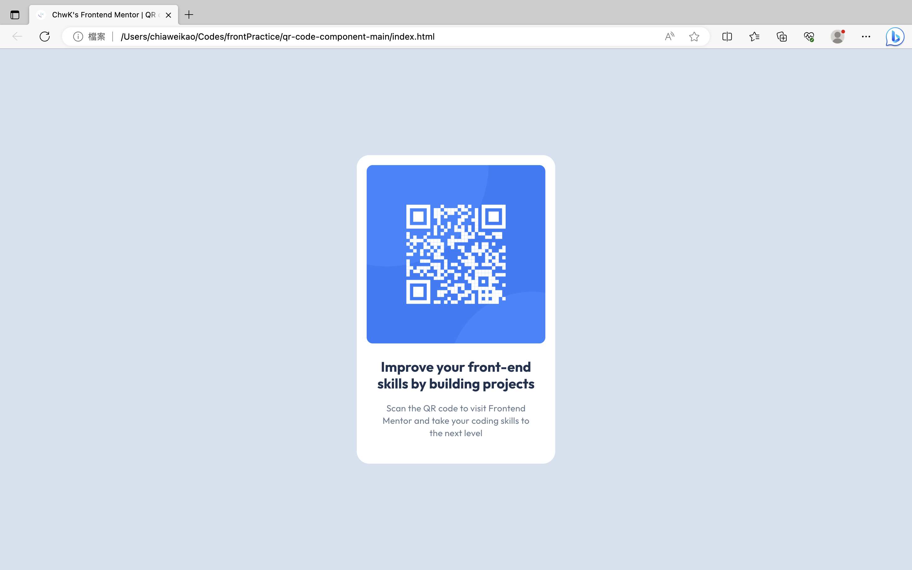

# Frontend Mentor - QR code component solution

This is a solution to the [QR code component challenge on Frontend Mentor](https://www.frontendmentor.io/challenges/qr-code-component-iux_sIO_H). Frontend Mentor challenges help you improve your coding skills by building realistic projects. 

## Table of contents

- [Overview](#overview)
  - [Screenshot](#screenshot)
  - [Links](#links)
- [My process](#my-process)
  - [Built with](#built-with)
  - [What I learned](#what-i-learned)
  - [Continued development](#continued-development)
  - [Useful resources](#useful-resources)
- [Author](#author)
- [Acknowledgement](#acknowledgement)

## Overview

### Screenshot



### Links

- Solution URL: [ChiaChiaWei/Frontend_QRCode](https://github.com/ChiaChiaWei/Frontend_QRCode.git)
- Live Site URL: [ChwK | Frontend Mentor | QR code component](https://chiachiawei.github.io/Frontend_QRCode/)

## My process

### Built with

- CSS custom properties

### What I learned

1. Practise CSS language by using custom properties to set up the styles of html elements.

2. Using link tag to reference the css file to seperate the css code from html file, make it easier to maintain.

```html
<link href="style.css" rel="stylesheet">
```

3. Introduce modern CSS reset to this project to initialize the html style.

4. Learning the differences between 'px' and 'rem', then use them more wisely.

### Continued development

1. Keep using css and learn scss.

2. Introducing ReactJS in the future project.

### Useful resources

- [W3Schools](https://www.w3schools.com) - This helped me recalling some html tags. If there's something I forget, I would check on this site.
- [MDN Web Docs](https://developer.mozilla.org/zh-TW/docs/Web/CSS) - This is a web document which helped me to learn css properties. It's useful for those who are not yet so familiar with css and those who forget the properties.

## Author

- Frontend Mentor - [@ChiaChiaWei](https://www.frontendmentor.io/profile/ChiaChiaWei)
- LinkedIn - [@Chia-Wei Kao](www.linkedin.com/in/chia-wei-kao)

## Acknowledgement

Especially thank to [@Stroudy](https://www.frontendmentor.io/profile/Stroudy), who had given me know-how of css and practical advices.